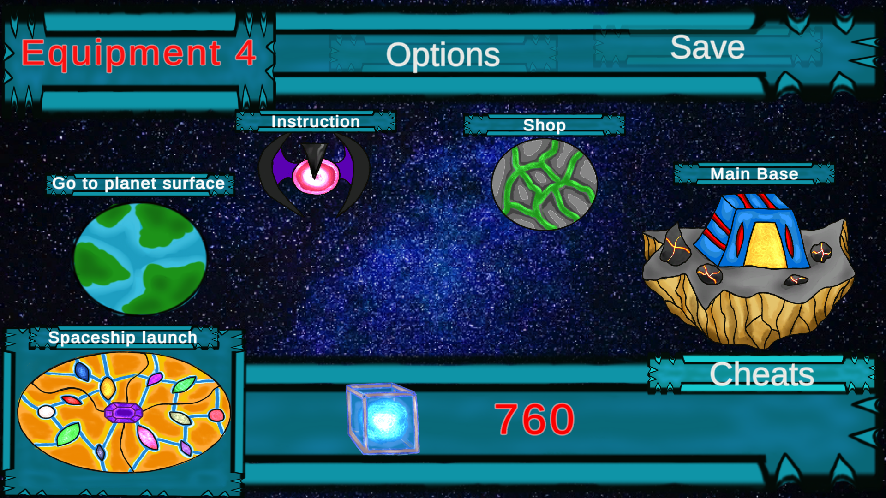
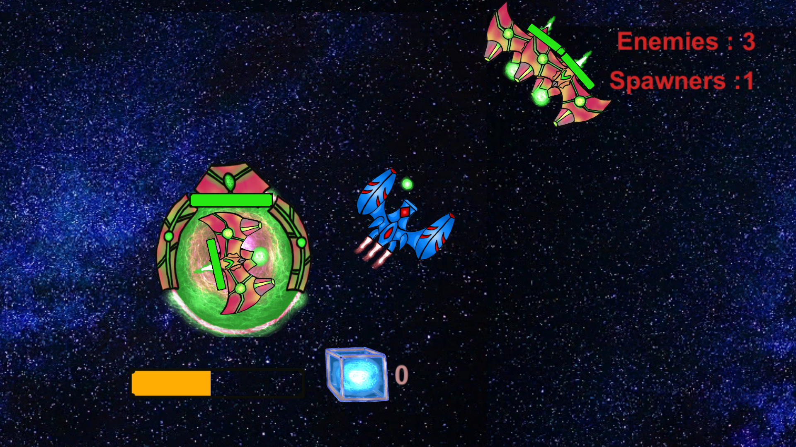
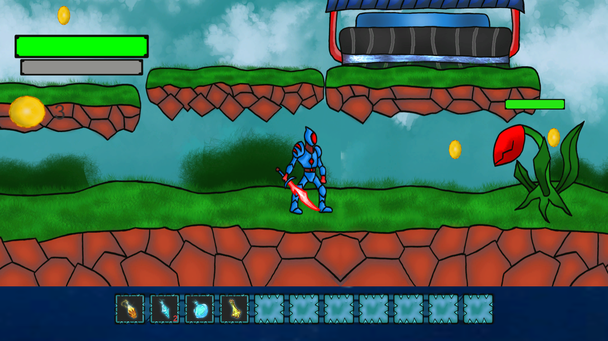
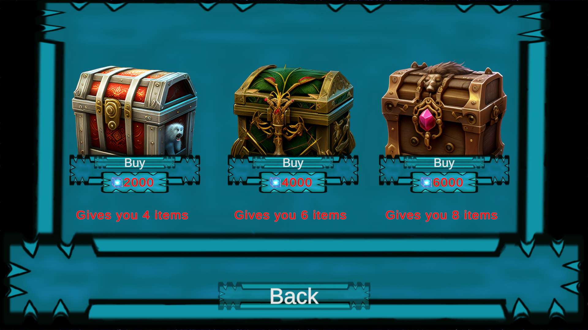
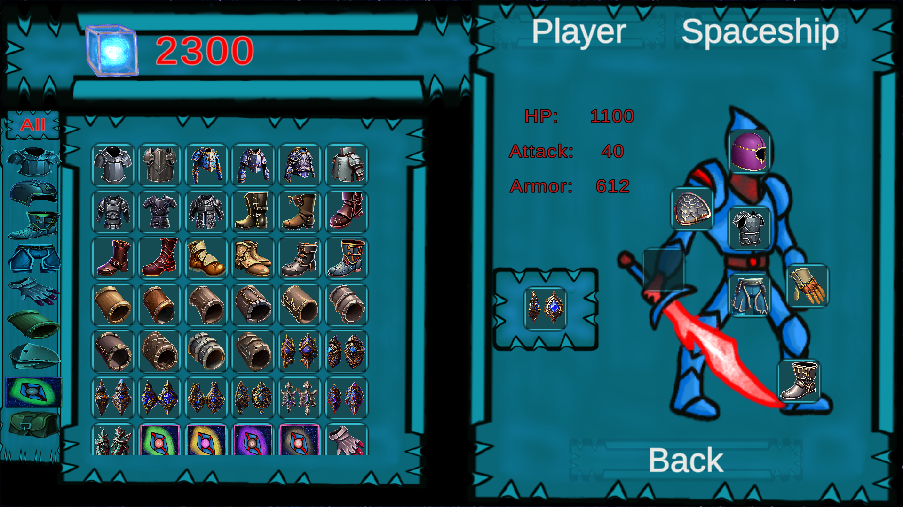
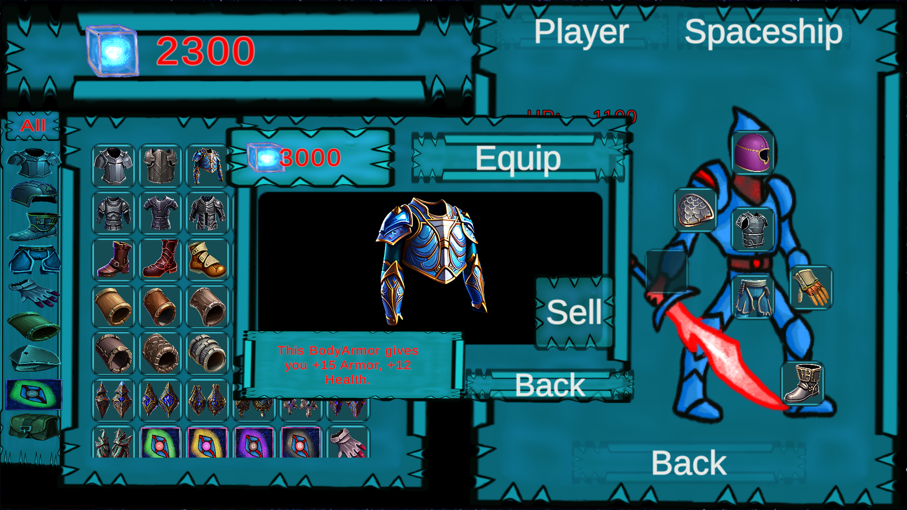
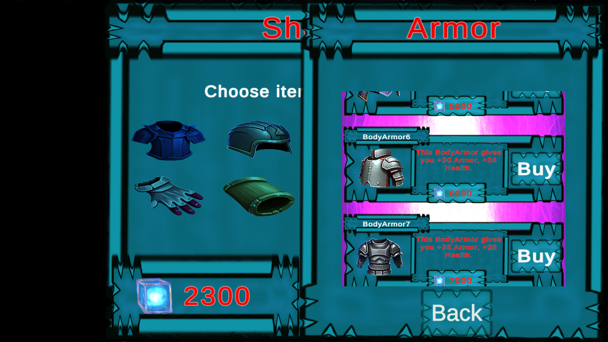
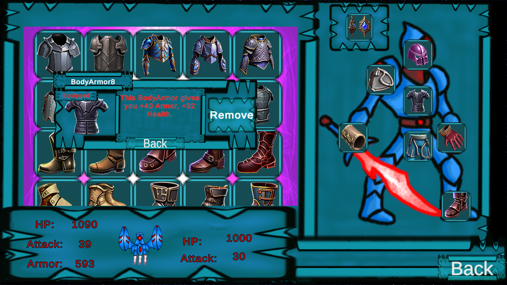

# Space-Adventure2

A computer game application with the ability to switch between five equipment systems was designed to test them. The main part of the application was made using the Unity engine. Visual Studio 2019 and the C# language were used to write the appropriate software. A user interface ergonomic evaluation checklist based on the Ravden-Johnson checklist was used to evaluate the individual equipment systems.

A massive 2D computer game created using the Unity Engine. The application contains inventory systems consisting of over 120 items implemented using:
- Scriptable objects,
- Vertical Layout Groups,
- Content Size Fitters,
- Grid Layout Groups,
- Prefabs.
  
The game also has mechanisms for selling and buying items. 

In system number 3, you can buy 3 chests (lootboxes) in the store:
• the first chest costs 2000 credits and contains 4 random items,
• the second chest costs 4000 credits and contains 6 random items,
• the third chest costs 6,000 credits and contains 8 random items,
Drawn items may be repeated multiple times.

In system number 4 
Purchasing items is only possible if the shopping cart is present
active.The basket consists of several important parts:
1. A small information panel about your funds.
2. Graphical representation of the basket contents.
3. Total price for all items in the cart.

Items can be added to the cart if the user wishes to do so,
just click on any item with your cursor. After clicking, a panel will appear
adding an item to the cart.
Items can also be removed from the cart to do this, the user
must click on one of the items in the cart.

  The read-write system has been created and is responsible for writing and reading data to
Save.txt file.
## Images

